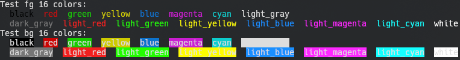

# LogColors

Colored and formated text generator for std::ostream on C++20.

## Usage
```cpp
#define USE_SCT_LC
#include <LogColors.hpp>
#include <iostream>
// ...
using LC::fg;
using LC::bg;
using LC::form;
std::cout << fg::blue << form::bold << "Blue bold text!" << LC::off << '\n';
std::cout << bg::yellow << form::italic << "Yellow italic text!" << LC::off << '\n';
```

## Download or Install
- [You can download one header version!](https://github.com/SuicideCatt/LogColors/releases/latest)
- Debian package available on [releases](https://github.com/SuicideCatt/LogColors/releases/latest)

	```bash
	$ curl -o LogColors.deb -L $URL
	# dpkg -i LogColors.deb 
	```

## Supported colors
- 16 colors
	
	
- 256 colors
	
	

## TODO
- [ ] RGB colors palette
- [ ] Add std::wostream support
- [ ] Add RPM package
- [ ] Add Arch package
